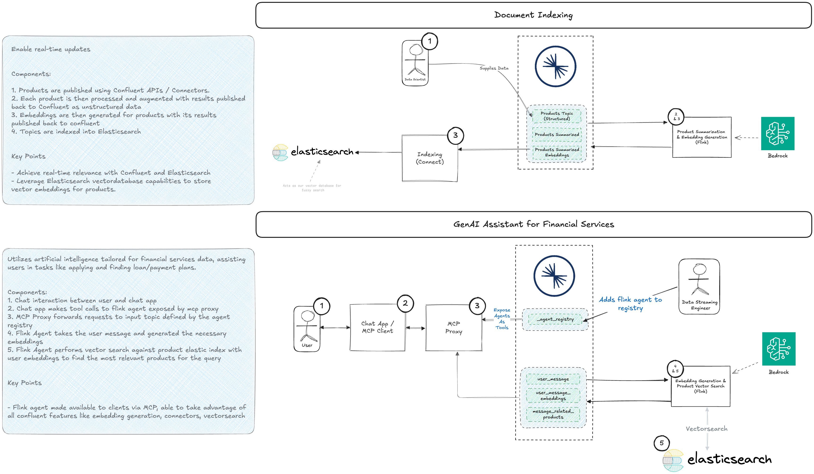

# Flink-Based Loan Product Search Agent

[Back to Main README](../../README.md)

## Table of Contents

- [Flink-Based Loan Product Search Agent](#flink-based-loan-product-search-agent)
  - [Table of Contents](#table-of-contents)
  - [Overview](#overview)
  - [Architecture](#architecture)
  - [Prerequisites](#prerequisites)
  - [Step-by-Step Guide](#step-by-step-guide)
    - [1. Set Up Flink Connections](#1-set-up-flink-connections)
    - [2. Create Bedrock Models](#2-create-bedrock-models)
    - [3. Set Up Elasticsearch](#3-set-up-elasticsearch)
    - [4. Create Flink Tables](#4-create-flink-tables)
    - [5. Set Up Document Indexing](#5-set-up-document-indexing)
      - [5.1 Create Elasticsearch Sink Connector](#51-create-elasticsearch-sink-connector)
      - [5.2 Insert Sample Products](#52-insert-sample-products)
      - [5.3 Generate Product Summaries](#53-generate-product-summaries)
      - [5.4 Generate Product Embeddings](#54-generate-product-embeddings)
    - [6. Create the Processing Pipeline](#6-create-the-processing-pipeline)
      - [6.1 Generate Message Embeddings](#61-generate-message-embeddings)
      - [6.2 Correlate products to messages](#62-correlate-products-to-messages)
    - [7. Register the Agent with Agent Proxy](#7-register-the-agent-with-mcpopenapi-proxy)
  - [Testing the Agent](#testing-the-agent)
  - [Conclusion](#conclusion)

## Overview

This tutorial demonstrates how to create a real-time loan product search agent using Confluent Flink and expose it as a
tool through the Agent Proxy. The agent processes user queries, finds the most relevant loan products using vector
search, and returns the results in real-time.


## Architecture

The agent works in the following way:

1. User sends a query about loan products
2. Query is converted to embeddings using Amazon Bedrock
3. Vector search finds the most relevant products in Elasticsearch
4. Results are returned through Agent Proxy



## Prerequisites

Before starting, ensure you have:

1. A Confluent Cloud account with Flink enabled
2. The Confluent CLI installed and configured
3. An Elasticsearch cluster set up and accessible, with api key/secrets and an account with appropriate permissions
4. AWS credentials for accessing Bedrock services

## Step-by-Step Guide

### 1. Set Up Flink Connections

First, create the necessary Flink connections to external services:

```shell
# Create Bedrock connection for embeddings
confluent flink connection create bedrock-titan-embed-connection \
  --cloud GCP \
  --region us-east4 \
  --environment env-03gdd9 \
  --type bedrock \
  --endpoint https://bedrock-runtime.us-east-1.amazonaws.com/model/amazon.titan-embed-text-v1/invoke \
  --aws-access-key $AWS_ACCESS_KEY_ID \
  --aws-secret-key $AWS_SECRET_ACCESS_KEY \
  --aws-session-token $AWS_SESSION_TOKEN

# Create Bedrock connection for Claude
confluent flink connection create bedrock-claude-35-connection \
  --cloud GCP \
  --region us-east4 \
  --environment env-03gdd9 \
  --type bedrock \
  --endpoint https://bedrock-runtime.us-east-1.amazonaws.com/model/anthropic.claude-3-5-sonnet-20240620-v1:0/invoke \
  --aws-access-key $AWS_ACCESS_KEY_ID \
  --aws-secret-key $AWS_SECRET_ACCESS_KEY \
  --aws-session-token $AWS_SESSION_TOKEN

# Create Elasticsearch connection
confluent flink connection create elastic-connection \
  --cloud GCP \
  --region us-east4 \
  --type elastic \
  --endpoint ${ELASTICSEARCH_ENDPOINT} \
  --api-key ${ELASTIC_API_KEY}
```

### 2. Create Bedrock Models

Set up the models for text generation and embeddings:

```sql
-- General text generation model
CREATE
MODEL BedrockGeneralModel
INPUT (text STRING)
OUTPUT (response STRING)
COMMENT 'General model with no system prompt.'
WITH (
    'task' = 'text_generation',
    'provider' = 'bedrock',
    'bedrock.PARAMS.max_tokens' = '200000',
    'bedrock.PARAMS.temperature' = '0.1',
    'bedrock.connection' = 'bedrock-claude-35-connection',
    'bedrock.client_timeout' = '120',
    'bedrock.system_prompt' = ''
);

-- Embedding model
CREATE
MODEL BedrockTitanEmbed
INPUT (text STRING)
OUTPUT (embeddings ARRAY<FLOAT>)
WITH (
    'bedrock.connection' = 'bedrock-titan-embed-connection',
    'task' = 'embedding',
    'provider' = 'bedrock'
);
```

### 3. Set Up Elasticsearch

Create an Elasticsearch index with proper vector search capabilities:

```json
PUT /products_summarized_with_embeddings/_mapping
{
  "properties": {
    "embeddings": {
      "type": "dense_vector",
      "dims": 1536,
      "index": true,
      "similarity": "cosine",
      "index_options": {
        "type": "int8_hnsw",
        "m": 16,
        "ef_construction": 100
      }
    },
    "product_id": {
      "type": "text"
    },
    "summary": {
      "type": "text"
    },
    "description": {
      "type": "text"
    },
    "name": {
      "type": "text"
    },
    "type": {
      "type": "text"
    },
    "currency": {
      "type": "text"
    },
    "term_min_length": {
      "type": "text"
    },
    "term_max_length": {
      "type": "text"
    },
    "repayment_frequency": {
      "type": "text"
    },
    "risk_level": {
      "type": "text"
    },
    "status": {
      "type": "text"
    },
    "rate_table": {
      "type": "text"
    },
    "createdAt": {
      "type": "text"
    },
    "updatedAt": {
      "type": "text"
    },
    "ref_link": {
      "type": "text"
    }
  }
}
```

### 4. Create Flink Tables

First, let's create all the necessary tables for our data pipeline:

```sql
-- Table for raw product data
CREATE TABLE products
(
  product_id          STRING PRIMARY KEY NOT ENFORCED,
  description         STRING,
  type                STRING,
  name                STRING,
  currency            STRING,
  term_min_length     STRING,
  term_max_length     STRING,
  repayment_frequency STRING,
  risk_level          STRING,
  status              STRING,
  rate_table          STRING,
  createdAt           STRING,
  updatedAt           STRING,
  ref_link            STRING
) WITH (
    'changelog.mode' = 'append',
    'kafka.cleanup-policy' = 'compact',
    'value.fields-include' = 'all',
    'key.format' = 'json-registry',
    'value.format' = 'json-registry'
    );

-- Table for summarized products
CREATE TABLE products_summarized
(
  product_id          STRING PRIMARY KEY NOT ENFORCED,
  summary             STRING,
  description         STRING,
  type                STRING,
  name                STRING,
  currency            STRING,
  term_min_length     STRING,
  term_max_length     STRING,
  repayment_frequency STRING,
  risk_level          STRING,
  status              STRING,
  rate_table          STRING,
  createdAt           STRING,
  updatedAt           STRING,
  ref_link            STRING
) WITH (
    'changelog.mode' = 'append',
    'kafka.cleanup-policy' = 'compact',
    'value.fields-include' = 'all',
    'key.format' = 'json-registry',
    'value.format' = 'json-registry'
    );

-- Table for products with embeddings
CREATE TABLE products_summarized_with_embeddings
(
  product_id          STRING PRIMARY KEY NOT ENFORCED,
  summary             STRING,
  description         STRING,
  type                STRING,
  name                STRING,
  currency            STRING,
  term_min_length     STRING,
  term_max_length     STRING,
  repayment_frequency STRING,
  risk_level          STRING,
  status              STRING,
  rate_table          STRING,
  createdAt           STRING,
  updatedAt           STRING,
  ref_link            STRING,
  embeddings          ARRAY<FLOAT>
) WITH (
    'changelog.mode' = 'append',
    'kafka.cleanup-policy' = 'compact',
    'value.fields-include' = 'all',
    'key.format' = 'json-registry',
    'value.format' = 'json-registry'
    );

-- Tables for handling user queries
CREATE TABLE user_message
(
  correlationId STRING PRIMARY KEY NOT ENFORCED,
  message       STRING
) WITH (
    'changelog.mode' = 'append',
    'kafka.cleanup-policy' = 'compact',
    'value.fields-include' = 'except-key',
    'key.format' = 'json-registry',
    'value.format' = 'json-registry'
    );

CREATE TABLE user_message_embeddings
(
  correlationId STRING PRIMARY KEY NOT ENFORCED,
  message       STRING,
  embeddings    ARRAY<FLOAT>
) WITH (
    'changelog.mode' = 'append',
    'kafka.cleanup-policy' = 'compact',
    'value.fields-include' = 'except-key',
    'key.format' = 'json-registry',
    'value.format' = 'json-registry'
    );

CREATE TABLE user_message_related_products
(
  correlationId   STRING PRIMARY KEY NOT ENFORCED,
  relatedProducts ROW<id STRING,
  description     STRING> ARRAY
) WITH (
    'changelog.mode' = 'append',
    'kafka.cleanup-policy' = 'compact',
    'value.fields-include' = 'except-key',
    'key.format' = 'json-registry',
    'value.format' = 'json-registry'
    );
```

### 5. Set Up Document Indexing

Now that we have our tables created, let's set up the document indexing pipeline.

#### 5.1 Create Elasticsearch Sink Connector

First, set up a connector to sync data from Kafka to Elasticsearch. You can do this through the Confluent UI or using
the following configuration:

```json
{
  "config": {
    "topics": "products_summarized_with_embeddings",
    "schema.context.name": "default",
    "input.data.format": "JSON_SR",
    "connector.class": "ElasticsearchSink",
    "name": "ElasticsearchSinkConnector_0",
    "kafka.auth.mode": "KAFKA_API_KEY",
    "kafka.api.key": "YOUR_KAFKA_API_KEY",
    "kafka.api.secret": "YOUR_KAFKA_API_SECRET",
    "connection.url": "YOUR_ELASTICSEARCH_URL",
    "connection.username": "elastic",
    "connection.password": "YOUR_PASSWORD",
    "elastic.security.protocol": "PLAINTEXT",
    "key.ignore": "false",
    "schema.ignore": "false",
    "compact.map.entries": "true",
    "write.method": "INSERT",
    "use.autogenerated.ids": "false",
    "behavior.on.null.values": "ignore",
    "behavior.on.malformed.documents": "fail",
    "drop.invalid.message": "false",
    "batch.size": "2000",
    "linger.ms": "1000",
    "flush.timeout.ms": "10000",
    "connection.compression": "false",
    "read.timeout.ms": "15000",
    "max.poll.interval.ms": "300000",
    "max.poll.records": "500",
    "tasks.max": "1"
  }
}
```

#### 5.2 Insert Sample Products

Insert sample loan products into the `products` table:

```sql
INSERT INTO `products`
VALUES ('00003',
        '"pay in three" product where the customer can make payments from 3000$ to 30000$. \r\nYou need a credit score higher than 750 to be eligible for that product. \r\nThe money can only be used to pay invoices. \r\nThe customer must repay the full amount plus a 3 percent flat rate within the next 3 months. The invoice is paid for immediately by Big Friendly Bank but the payment is made in the name of the customer to avoid damaging his reputation with his creditors. \r\nOnce approved, whenever any amount has been fully paid back, the customer can pay any new invoice provided it''s under the maximum limit. \r\nWhenever the customer mentions having to buy goods for less than $30,000 or pay an invoice with a due amount of less than $30,000, Colin should always mention the \"Pay-in-three\" option.\r\n',
        'payment',
        'pay in three',
        'USD',
        '3 months',
        '3 months',
        'monthly',
        'medium',
        'active',
        '| credit score           \t| rate          \t|\n|------------------------\t|---------------\t|\n| more than 750          \t| 3%            \t|\n| less than equal to 750 \t| not available \t|',
        '2022-01-01',
        '2022-01-01',
        'https://www.bigfriendlybank.com/pay-in-three.pdf'),
       ('00002',
        '"credit builder" loan for customers that never had a loan before. \r\nThis "credit builder" loan  has a higher rate, because the bank doesn''t have the repayment behaviour history of the customer so it''s more risky. \r\nA "credit builder" loan must be repaid within 2 years and the maximum amount a customer can borrow is 35000$. \r\nThe rate table to use for a "credit builder" loan is as follow:\r\n\r\n| number of years in trading     | rate |\r\n| ------------------------------ | ---- |\r\n| between 0 and 6 months         | 15   |\r\n| between 6 and 12 months        | 12   |\r\n| between 12 and 24 months       | 10   |',
        'loan',
        'credit builder',
        'USD',
        '1 month',
        '2 years',
        'monthly',
        'high',
        'active',
        '| number of years in trading     | rate |\n| ------------------------------ | ---- |\n| between 0 and 6 months         | 15   |\n| between 6 and 12 months        | 12   |\n| between 12 and 24 months       | 10   |',
        '2023-01-01',
        '2023-01-01',
        'https://www.bigfriendlybank.com/builder-loan.pdf'),
       ('00001',
        'classic commercial loan that is taken by a customer, from 30,000$ to 250,000$. The loan annual rate is calculated by determining the creditworthiness of the customer. The loan term can be between 1 and 7 years. Each repayment is paid each month and must be done on time, otherwise there will be accrued interests incurred.\r\n\r\nUse the following rate table for find the rate based on the customer credit score. Customers need a credit score of 350 or more to be eligible for the classic commercial loan, if not, they can apply for a "credit builder" loan instead. \r\n\r\n| credit score        | rate |\r\n| ------------------- | ---- |\r\n| more than 750       | 3.5  |\r\n| between 500 and 750 | 5.6  |\r\n| between 350 and 500 | 8.3  |\r\n| less than 350       | 12   |',
        'loan',
        'classic commercial',
        'USD',
        '1 year',
        '7 years',
        'monthly',
        'low',
        'active',
        '| credit score        | rate |\n| ------------------- | ---- |\n| more than 750       | 3.5  |\n| between 500 and 750 | 5.6  |\n| between 350 and 500 | 8.3  |\n| less than 350       | 12   |',
        '2024-01-01',
        '2024-01-01',
        'https://www.bigfriendlybank.com/classic-loan.pdf'),
       ('00004',
        '"Flexible Business Line" is a revolving credit line for small businesses. Amounts range from $10,000 to $100,000. Eligibility requires a business credit score of at least 600 and 2+ years in operation. Interest is charged only on the amount used, with rates varying from 6% to 12% based on creditworthiness. The credit line remains open indefinitely as long as the account remains in good standing, with an annual review. Repayments are interest-only monthly, with the option to pay down the principal at any time.',
        'credit_line',
        'flexible business line',
        'USD',
        '1 month',
        'Indefinite',
        'monthly',
        'medium',
        'active',
        '| Business Credit Score | Rate |\n| ---------------------- | ---- |\n| 800+                   | 6%   |\n| 700-799                | 8%   |\n| 600-699                | 12%  |',
        '2025-03-28',
        '2025-03-28',
        'https://www.bigfriendlybank.com/flexible-business-line.pdf'),
       ('00005',
        '"Green Energy Upgrade" loan for homeowners looking to install solar panels or other energy-efficient upgrades. Loan amounts range from $5,000 to $50,000. Eligibility requires a credit score of 680+ and proof of homeownership. The loan term is 5-15 years with a fixed interest rate of 4.5%. Monthly repayments include principal and interest. As an incentive, customers receive a 0.25% interest rate reduction if they set up automatic payments.',
        'loan',
        'green energy upgrade',
        'USD',
        '5 years',
        '15 years',
        'monthly',
        'low',
        'active',
        '| Credit Score | Rate |\n| ------------ | ---- |\n| 680+         | 4.5% |\n| Auto-pay     | 4.25%|',
        '2025-03-28',
        '2025-03-28',
        'https://www.bigfriendlybank.com/green-energy-loan.pdf'),
       ('00006',
        '"Startup Boost" loan designed for new businesses less than 2 years old. Loan amounts range from $10,000 to $75,000. No business credit history required, but personal credit score must be 630+. Loan term is 1-5 years with monthly repayments. Interest rates start at 8% and go up to 18% based on the founder''s credit score and business plan viability. Comes with free business mentoring sessions.',
        'loan',
        'startup boost',
        'USD',
        '1 year',
        '5 years',
        'monthly',
        'high',
        'active',
        '| Personal Credit Score | Rate Range |\n| --------------------- | ----------- |\n| 750+                  | 8% - 12%    |\n| 680-749               | 10% - 15%   |\n| 630-679               | 13% - 18%   |',
        '2025-03-28',
        '2025-03-28',
        'https://www.bigfriendlybank.com/startup-boost.pdf'),
       ('00007',
        '"Education Elevation" loan for students pursuing higher education or professional certifications. Loan amounts from $5,000 to $100,000. Open to students with a co-signer having a credit score of 700+. Repayment begins 6 months after graduation or leaving school. Loan term is 5-20 years with income-based repayment options. Fixed interest rate of 5% during school, increasing to 6.5% after the grace period.',
        'loan',
        'education elevation',
        'USD',
        '5 years',
        '20 years',
        'monthly',
        'medium',
        'active',
        '| Period          | Rate |\n| --------------- | ---- |\n| During School   | 5%   |\n| After Grace     | 6.5% |',
        '2025-03-28',
        '2025-03-28',
        'https://www.bigfriendlybank.com/education-elevation.pdf'),
       ('00008',
        '"Microbusiness Kickstart" loan for very small businesses and sole proprietors. Loan amounts from $1,000 to $15,000. Minimal credit requirements (credit score 600+), but requires a solid business plan. Loan term is 6 months to 3 years with weekly repayments to make it more manageable for small businesses. Fixed interest rate of 10%, with a 1% reduction after successful repayment of 50% of the loan.',
        'loan',
        'microbusiness kickstart',
        'USD',
        '6 months',
        '3 years',
        'weekly',
        'high',
        'active',
        '| Loan Progress | Rate |\n| ------------- | ---- |\n| Initial       | 10%  |\n| After 50%     | 9%   |',
        '2025-03-28',
        '2025-03-28',
        'https://www.bigfriendlybank.com/microbusiness-kickstart.pdf'),
       ('00009',
        '"Home Renovation Flex" loan for homeowners looking to upgrade their properties. Loan amounts from $25,000 to $200,000. Requires a credit score of 700+ and a loan-to-value ratio of 80% or less after renovation. Loan term is 5-20 years. Unique feature: interest-only payments for the first year to accommodate renovation period. After the first year, switches to a fixed rate (determined at loan origination) with principal and interest payments.',
        'loan',
        'home renovation flex',
        'USD',
        '5 years',
        '20 years',
        'monthly',
        'low',
        'active',
        '| Credit Score | Rate |\n| ------------ | ---- |\n| 750+         | 4.5% |\n| 700-749      | 5.25%|',
        '2025-03-28',
        '2025-03-28',
        'https://www.bigfriendlybank.com/home-renovation-flex.pdf'),
       ('00010',
        '"Seasonal Business Bridge" loan designed for businesses with cyclical revenue patterns. Loan amounts from $20,000 to $150,000. Eligibility requires 2+ years in business and a credit score of 650+. Unique repayment structure: lower payments during off-season months, higher payments during peak season. Loan term is 1-5 years. Interest rates from 7% to 11% based on business financials and credit score.',
        'loan',
        'seasonal business bridge',
        'USD',
        '1 year',
        '5 years',
        'monthly',
        'medium',
        'active',
        '| Credit Score | Rate Range |\n| ------------ | ----------- |\n| 750+         | 7% - 8%     |\n| 700-749      | 8% - 9.5%   |\n| 650-699      | 9.5% - 11%  |',
        '2025-03-28',
        '2025-03-28',
        'https://www.bigfriendlybank.com/seasonal-business-bridge.pdf'),
       ('00011',
        '"Tech Startup Accelerator" loan specifically for technology startups. Loan amounts from $50,000 to $500,000. Eligibility based on innovation potential, team experience, and market opportunity rather than traditional credit scores. Loan term is 3-7 years with interest-only payments for the first 18 months. After 18 months, switches to principal and interest payments. Interest rates from 8% to 14% based on risk assessment. Comes with access to a network of tech mentors and potential investors.',
        'loan',
        'tech startup accelerator',
        'USD',
        '3 years',
        '7 years',
        'monthly',
        'high',
        'active',
        '| Risk Assessment | Rate Range |\n| ---------------- | ----------- |\n| Low Risk         | 8% - 10%    |\n| Medium Risk      | 10% - 12%   |\n| High Risk        | 12% - 14%   |',
        '2025-03-28',
        '2025-03-28',
        'https://www.bigfriendlybank.com/tech-startup-accelerator.pdf'),
       ('00012',
        '"Community Development Fund" loan for businesses operating in underserved areas or owned by minority entrepreneurs. Loan amounts from $10,000 to $250,000. Relaxed credit requirements (minimum score of 600) but requires a clear community benefit plan. Loan term is 2-10 years. Interest rates from 3% to 7% based on credit score and community impact assessment. Monthly repayments with the option for a 6-month initial grace period.',
        'loan',
        'community development fund',
        'USD',
        '2 years',
        '10 years',
        'monthly',
        'medium',
        'active',
        '| Credit Score | Community Impact | Rate |\n| ------------ | ----------------- | ---- |\n| 700+         | High              | 3%   |\n| 700+         | Medium            | 4%   |\n| 650-699      | High              | 4.5% |\n| 650-699      | Medium            | 5.5% |\n| 600-649      | High              | 6%   |\n| 600-649      | Medium            | 7%   |',
        '2025-03-28',
        '2025-03-28',
        'https://www.bigfriendlybank.com/community-development-fund.pdf'),
       ('00013',
        '"Eco-Fleet Upgrade" loan for businesses looking to replace their vehicle fleets with electric or hybrid alternatives. Loan amounts from $100,000 to $2,000,000. Requires a business credit score of 700+ and at least 5 years in operation. Loan term is 5-10 years. Interest rates from 4% to 6% based on creditworthiness and percentage of fleet being upgraded. Monthly repayments with the option to defer principal payments for the first 6 months to accommodate the transition period.',
        'loan',
        'eco-fleet upgrade',
        'USD',
        '5 years',
        '10 years',
        'monthly',
        'low',
        'active',
        '| Business Credit Score | Fleet Upgrade % | Rate |\n| ---------------------- | ---------------- | ---- |\n| 800+                   | 75%+             | 4%   |\n| 800+                   | 50-74%           | 4.5% |\n| 750-799                | 75%+             | 4.5% |\n| 750-799                | 50-74%           | 5%   |\n| 700-749                | 75%+             | 5%   |\n| 700-749                | 50-74%           | 6%   |',
        '2025-03-28',
        '2025-03-28',
        'https://www.bigfriendlybank.com/eco-fleet-upgrade.pdf');
```

#### 5.3 Generate Product Summaries

Create summaries of the products using the Claude model:

```sql
insert into `products_summarized`
select product_id,
       response,
       description,
       type,
       name,
       currency,
       term_min_length,
       term_max_length,
       repayment_frequency,
       risk_level,
       status,
       rate_table,
       createdAt,
       updatedAt,
       ref_link
from `products`,
     LATERAL TABLE (
        ML_PREDICT (
            'BedrockGeneralModel',
            (
'
<instructions>
You are a summarization assistant tasked with generating concise, accurate summaries of loan data for indexing in a vector database. Your summary must include all key information such as the required credit score, term of the loan, name of the loan, interest rate, and any other significant details provided in the input. The output should be a single-paragraph summary suitable for indexing purposes. **Do not include any tags (e.g., XML or JSON) in the response. Only provide plain text.**
</instructions>

<context>
This task involves summarizing structured loan objects into natural language. Make sure all important fields are represented accurately, with special attention to differentiating between the loan''s requirements (e.g., required credit score) and other details. The goal is to capture the essence of the loan data so it can be easily retrieved based on similarity.
</context>

<examples>
<example>
<input>
{
  "product_id": "HEQ-12345",
  "description": "A loan product designed for homeowners to access the equity in their property for large expenses.",
  "type": "Home Equity Loan",
  "name": "Home Equity Advantage Loan",
  "currency": "USD",
  "term_min_length": 5,
  "term_max_length": 30,
  "repayment_frequency": "Monthly",
  "risk_level": "Medium",
  "status": "Active",
  "rate_table": "| credit score           \t| rate          \t|\n|------------------------\t|---------------\t|\n| more than 750          \t| 3%            \t|\n| less than equal to 750 \t| not available \t|,
  "createdAt": "2024-11-01T10:00:00Z",
  "updatedAt": "2024-11-15T10:00:00Z",
  "ref_link": "https://www.bankexample.com/products/home-equity-loan"
}
</input>
<output>
The "Home Equity Advantage Loan" is a Home Equity Loan designed for homeowners to access property equity for significant expenses. It is offered in USD, with loan terms ranging from 5 to 30 years and a monthly repayment frequency. This product has a medium risk level and is currently active. The interest rate is 3% for borrowers with a credit score above 750; it is unavailable for those with lower scores.
</output>
</example>
</examples>

<format>
Respond in a concise single-paragraph summary format, including all critical loan details. Avoid introducing extra commentary or unrelated information.
</format>

<persona>
You are a precise and detail-oriented assistant trained to create summaries for structured data. Ensure your tone is professional and factual.
</persona>

<task>
Please process the following loan object and provide a summary:
<loan_object>
{
  "product_id": "' || `product_id` || '",
  "description": "' || `description` || '",
  "type": "' || `type` || '",
  "name": "' || `name` || '",
  "currency": "' || `currency` || '",
  "term_min_length":  ' || `term_min_length` || ',
  "term_max_length": ' || `term_max_length` || ',
  "repayment_frequency": "' || `repayment_frequency` || '",
  "risk_level": "' || `risk_level` || '",
  "status": "' || `status` || '",
  "rate_table": "' || `rate_table` || '"",
  "createdAt": "' || `createdAt` || '",
  "updatedAt": "' || `updatedAt` || '",
  "ref_link": "' || `ref_link` || '"
}
</loan_object>
</task>
'
            )
        )
    );
```

#### 5.4 Generate Product Embeddings

Create embeddings for the summarized products:

```sql
insert into
    `products_summarized_with_embeddings`
select
    product_id,
    summary,
    description,
    type,
    name,
    currency,
    term_min_length,
    term_max_length,
    repayment_frequency,
    risk_level,
    status,
    rate_table,
    createdAt,
    updatedAt,
    ref_link,
    embeddings
from
    `products_summarized`,
    LATERAL TABLE (ML_PREDICT ('BedrockTitanEmbed', summary));
```

### 6. Create the Processing Pipeline

#### 6.1 Generate Message Embeddings

Generate embeddings for user messages

```sql
INSERT INTO user_message_embeddings
SELECT correlationId,
       message,
       embeddings
FROM user_message,
     LATERAL TABLE (ML_PREDICT ('BedrockTitanEmbed', message));
```

#### 6.2 Correlate products to messages

Use the generated message embeddings to find 3 related products

```sql
-- Find related products using vector search
INSERT INTO user_message_related_products
SELECT correlationId,
       search_results as relatedProducts
FROM user_message_embeddings,
     LATERAL TABLE(VECTOR_SEARCH(elastic, 3, embeddings));
```

### 7. Register the Agent with Agent Proxy

Finally, register the agent to make it available through the Agent Proxy:

```sql
INSERT INTO _agent_registry
VALUES ('LoanProductSearchAgent',
        'This agent searches the most relevant loan products based on the clients request',
        'user_message',
        'user_message_related_products',
        'correlationId',
        'tool',
        '',
        '');
```

## Testing the Agent

Once set up, you can test the agent by invoking the `LoanProductSearchAgent` tool with an mcp client against the mcp
proxy server:

1. Sending a message to the `user_message` topic
2. The pipeline will automatically process it and find relevant products
3. Results will be available in the `user_message_related_products` topic
4. The agent can be accessed through the Agent Proxy interface

## Conclusion

You now have a working loan product search agent that:

- Processes user queries in real-time
- Uses vector search to find relevant products
- Is accessible through the Agent Proxy
- Can be integrated into other applications

For sample loan data and additional configuration options, refer to the appendix below.

